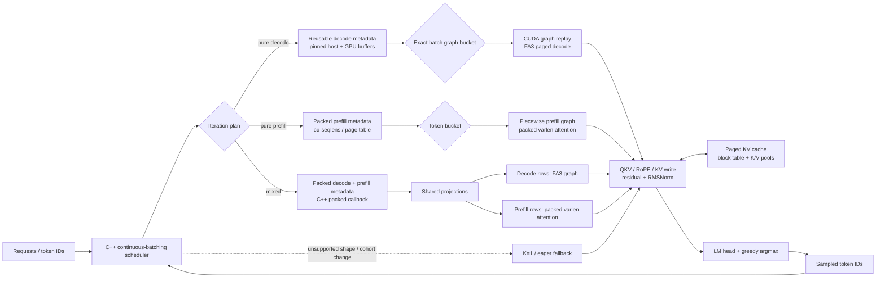

# Qwen-frence

> **Results scope:** The recorded scorecard below is historical: vLLM **0.10.2**,
> with local FA3 paths calling vLLM's bundled external FlashAttention kernels.
> It is not evidence of independently implemented FA3 or a win over current vLLM.
> Replacement work targets vLLM **0.30.0** in a separate environment. The new
> project-owned Hopper TMA/WGMMA decode/varlen implementation is an **unvalidated
> candidate**, not yet a measured replacement. Historical artifacts are retained
> unchanged; new results must use fresh output directories.

Given Qwen2.5-1.5B and some bounded input regime, how fast can we push inference on one H100? This project wraps a specialized inference engine around Qwen2.5-1.5B and benchmarks it against the general-purpose engine vLLM. We build a grid of inputs spanning short/long contexts and small/large batches, then measure pure prefill, pure decode, and mixed iterations on this fixed model and bounded input scenario. In the end, across three runs per cell our engine's slowest run exceeded vLLM's fastest run by at least 1.139× under both burst and staggered arrivals. The output token counts are identical within each cell.

## Workload matrix

We vary the following properties of the inputs:

- Batch sizes: 8 and 64
- Prompt lengths: 256 and 2048 tokens
- Output lengths: 128 and 256 tokens
- Burst and staggered mixed arrivals
- Pure prefill/decode phase diagnostics on every cell

## Key improvements

The original engine wrapped a minimal continuous-batching engine with limited fused kernels, CUDA graph capture, a FlashAttention2 kernel, and a Python scheduler. The current engine adds model and regime-specific kernels, a C++ scheduler, FA3 decode attention, packed projections, and shape-specific graph capture. We intentionally do not use contiguous KV allocation or speculative decoding in this comparison.

Optimization inventory (brief):

- **Scheduling:** C++ continuous batching, packed mixed callbacks, fixed token budgets, reusable pinned/device metadata, double buffering, GPU-resident state prototype, incremental page-table prototype.
- **Graphs:** exact-batch decode graphs, piecewise token-bucket prefill graphs, mixed packed graph buckets, and a K=2/4/8 unrolled-graph prototype (not enabled in the final scorecard).
- **Attention:** packed variable-length prefill attention, FA3 paged decode, packed/varlen mixed attention, fresh and resumed tile dispatch, native CUDA attention prototype, split-K baseline.
- **GEMMs and projections:** packed QKV, packed gate/up, cuBLAS/packed QKV epilogue prototype, output-projection profiling.
- **Layer fusions:** residual-add/RMSNorm, QKV → RoPE/KV-write, K-only RoPE/KV-write, thresholded SwiGLU, fused LM head and exact greedy argmax.
- **Evaluation controls:** matched vLLM runner, full-logit/KV/token gates, scheduler-plan validation, graph mutation checks, fixed eight-cell scorecard.

## High-level system design



The scheduler dictates request state, admission, prefill chunks, decode cohorts, and
the paged block table. The model adapter receives one planned iteration and chooses
the specialized path: an exact-batch decode graph, a piecewise packed-prefill graph,
or the packed mixed callback. Every path reads and writes the same paged KV pools;
sampling returns token IDs to the scheduler, which advances or completes requests.

## Empirical evidence

The canonical final artifact is [`experiments/results/current-eight-vs-vllm-v2/summary.json`](experiments/results/current-eight-vs-vllm-v2/summary.json). It compares against **vLLM 0.10.2** across all eight fixed shapes, each measured as burst and staggered mixed workloads. Every one of the 16 end-to-end comparisons favors the current engine. **Every `x` value below is a speedup:** `1.5x` means local is 1.5 times faster than vLLM; below `1.0x` means local is slower. End-to-end speedup divides local output tokens/s by vLLM output tokens/s.

Each cell was measured **three times per engine**; the tables report medians.
For every one of the 16 end-to-end burst/mixed comparisons, even the slowest
local run beat the fastest vLLM run. The smallest such margin was **1.139x**
(B64 / P2048 / O128, mixed). This worst-run check concerns end-to-end output
throughput; the pure-prefill step comparisons below include slower local cells.

| Regime | Burst speedup (median n=3)| Mixed speedup (median n=3)| Local mixed output tok/s | Exact output requests, burst | Exact output requests, mixed |
|---|---:|---:|---:|---:|---:|
| B8 / P256 / O128 | 1.437x | 1.279x | 3,183 | 8/8 | 7/8 |
| B8 / P256 / O256 | 1.386x | 1.322x | 3,321 | 8/8 | 7/8 |
| B8 / P2048 / O128 | 1.202x | 1.173x | 2,340 | 7/8 | 8/8 |
| B8 / P2048 / O256 | 1.226x | 1.192x | 2,693 | 7/8 | 8/8 |
| B64 / P256 / O128 | 1.411x | 1.421x | 18,483 | 62/64 | 62/64 |
| B64 / P256 / O256 | 1.445x | 1.436x | 20,480 | 62/64 | 62/64 |
| B64 / P2048 / O128 | 1.168x | 1.153x | 6,180 | 63/64 | 63/64 |
| B64 / P2048 / O256 | 1.194x | 1.248x | 9,003 | 63/64 | 63/64 |

Mixed output tok/s is the median throughput of the complete staggered workload,
including prefill and decode, rather than the throughput of one scheduler step.

The separate [phase measurements](experiments/results/current-eight-vs-vllm-v2/phases/) report synchronized median step wall time. Phase speedup is `vLLM ms / local ms`.

| Regime | Pure prefill, local / vLLM (ms) | Prefill speedup | Pure decode, local / vLLM (ms) | Decode speedup |
|---|---:|---:|---:|---:|
| B8 / P256 / O128 | 11.13 / 11.93 | 1.07x | 2.32 / 3.10 | 1.34x |
| B8 / P256 / O256 | 11.21 / 11.90 | 1.06x | 2.34 / 3.08 | 1.32x |
| B8 / P2048 / O128 | 13.33 / 12.42 | 0.93x | 2.58 / 3.11 | 1.21x |
| B8 / P2048 / O256 | 13.29 / 12.51 | 0.94x | 2.55 / 3.11 | 1.22x |
| B64 / P256 / O128 | 11.54 / 12.03 | 1.04x | 2.69 / 4.09 | 1.52x |
| B64 / P256 / O256 | 11.57 / 12.55 | 1.08x | 2.72 / 3.95 | 1.45x |
| B64 / P2048 / O128 | 13.72 / 13.24 | 0.97x | 3.78 / 4.93 | 1.31x |
| B64 / P2048 / O256 | 13.67 / 13.14 | 0.96x | 3.82 / 5.14 | 1.35x |

These step medians are diagnostics, not whole-workload rates: each prefill value
measures one pure-prefill step, and the schedulers can do different work per step.
For long prompts, later prefill work often occurs in mixed steps. Mixed-step
medians are about 1.03–1.09x in local's favor; the burst and mixed results above
time complete workloads.

For one B64/P256 decode step, the measured 2.69 ms median corresponds to about **23.8k generated tokens/s** (`64 / 0.00269`). An ideal HBM-transfer estimate at the start of that decode is about **60k tokens/s**: roughly 3.09 GB of FP16 weights plus 0.47 GB of KV data divided by the [H100 SXM's 3.35 TB/s peak bandwidth](https://developer.nvidia.com/blog/?p=94274). It assumes each element is fetched once from HBM and excludes compute and launch costs; caching can change actual HBM traffic, so this is not a strict hardware ceiling. At B64/C4096, the same estimate drops to about 20.2k tokens/s, versus 12.8k measured in the [long-context FA3 decode profile](experiments/results/matched-fa3-vllm-b64-c4096-v1/comparison.json).

### Kept interventions, ranked by measured impact

The ranking below compares the strongest measured effect for each retained intervention;
it labels whether the number is a kernel, phase, ablation, or end-to-end result. These
numbers should not be multiplied together: many rows are nested in the final engine.

| Rank | Kept intervention | Type | Explicit evidence | Scope |
|---:|---|---|---|---|
| 1 | FA3 paged decode attention | Attention kernel | 3.892x decode-wall, 1.511x mixed-wall, and 2.244x complete-workload improvement over split-K at B64/C4096. | Paired full-workload ablation |
| 2 | Exact-batch decode graphs | CUDA graph capture | 2.835x whole-workload and 2.895x decode-phase improvement over eager at B8/P256/O128; standalone B8/C2048 replay was 1.981x eager without input copies. | Integrated ablation + microbench |
| 3 | Packed ragged/variable-length prefill | Packing + attention kernel | 1.46x over serial admission and 1.11x attention improvement in the original B8 packed-prefill sweep. | End-to-end + attention microbench |
| 4 | Prefill token budget | Scheduling policy | B64 control output throughput rose from 2056 tok/s at budget 2048 to 2411 tok/s at 8192 (1.173x). | Full prefill/mixed sweep |
| 5 | Packed mixed callback and exact packed buckets | Scheduler + graph capture | Representative B8 mixed target fell from 12.864 ms separate to 8.412 ms packed-exact-qkv (1.529x); all-history correctness passed. | Matched mixed phase |
| 6 | Packed QKV projection | GEMM/projection packing | 2.34x B8 and 2.35x B64 projection microbench speedups; packed weights are used in the final model path. | Projection microbench |
| 7 | Packed gate/up projection | GEMM/projection packing | 1.19x B8 and 1.14x B64 projection microbench speedups. | Projection microbench |
| 8 | QKV RoPE/KV-write postprocess (Triton) | Fusion: QKV → RoPE/KV write | Full FA3 B64/C4096 decode 1.062x; complete wall 1.026x; logit tolerance passed. | Full-model fusion ladder |
| 9 | Conditional SwiGLU | Fusion: activation + multiply | B64 budget-8192 throughput rose 2341→2416 tok/s; large-row kernel sweep reached about 1.65x. | Full prefill sweep + microbench |
| 10 | C++ scheduler / metadata reuse | Scheduler + metadata | Prior engine 759.5→integrated eager C++ 823.5 output tok/s; packed mixed warm wall 30.812→29.044 ms (1.061x), with logits/KV/scheduler checks passing. | Full workload + model callback gate |
| 11 | Resumed-prefill tile dispatch | Kernel dispatch policy | Paged attention oracle 6.61% over static; the simple two-way rule captured 6.51%. | Paged-attention sweep |
| 12 | Residual add + RMSNorm | Fusion: residual + normalization | Despite a slower isolated kernel, full FA3 B64/C4096 decode improved 1.019x and wall 1.008x. | Full-model fusion ladder |
| 13 | Piecewise packed-prefill graphs | CUDA graph capture | Mutation-safe graph replay; integrated coverage passed correctness and avoided eager prefill calls in the fixed buckets. | Graph safety + integration gate |

### Follow-ups outside the final engine

The first two have small measured gains but need scheduler integration. The other
three are prototypes without a completed H100 full-engine timing result; their
benefit is still unknown. None contributes to the scorecard above.

| Candidate | Current evidence | Missing gate |
|---|---|---|
| K=2/4/8 unrolled decode graphs | Full logits/KV/EOS checks passed; production-like chunk gains were 0.5–1.1%. | C++ chunk admission/commit, first-EOS truncation, and K=1 fallback for changing cohorts. |
| Fused LM head / exact greedy argmax | Exact token/logit checks passed; about 0.4–0.8% per chunk when combined with K-step. | C++ chunk integration and full-table timing. |
| GPU-resident decode state | Opt-in path passes CPU correctness and falls back when the cohort changes. | H100 timing and CUDA correctness for changing cohorts. |
| Incremental page-table maintenance | Stable-address prototype skips redundant table copies. | Matched H100 timing and fallback validation. |
| Prefill QKV → RoPE/KV-write fusion | Candidate and padded-token masking path are implemented. | Full-engine prefill logits/KV correctness and paired timing across buckets. |

### Tested alternatives not selected

These results explain why an isolated win or a working prototype was not added
to the final engine.

| Candidate | Direct evidence | Decision |
|---|---|---|
| Native CUDA grouped-decode attention | At B64/C4096, the [matched warm test](experiments/results/decode-memory-causality/memory-causality-20260921T011458Z.json) measured native CUDA at 0.425 ms/layer, old Triton at 0.717 ms/layer, and FA3 at 0.122 ms/layer. Native beat old Triton but was **3.49x slower than FA3**. | Do not replace FA3. This kernel accepts one query token per request and cannot run multi-token prefill as written. |
| K-only RoPE/KV write | Correct within tolerance; decode 1.052x and wall 1.021x, versus 1.062x and 1.026x for the integrated full QKV postprocess. | Superseded by the faster integrated fusion. |
| cuBLAS/packed QKV epilogue | About 2.04x in isolation; passed the full FA3 gate but tied the integrated Triton QKV postprocess. | Equivalent alternative, not an additive fusion. |
| Full mixed forward CUDA graph | Correctness passed for supported fixed buckets. | Dynamic arrivals and packed token counts prevent general coverage. |
| Grouped-GQA head sharing | Grouped variants were slower in the matched attention sweep. | No measured gain over the selected FA3 path. |
| Custom full-QKV fused GEMM | Isolated kernel was about 1.8x faster, but full decode fell to 0.892x, wall to 0.948x, and logits exceeded tolerance. | Rejected for full-model slowdown and numerical error. |
| Mixed attention overlap | Two-stream upper-bound tests did not show a stable end-to-end gain. | Resource contention and join dependencies erased the benefit. |

The detailed status, source paths, tolerances, and missing production gates are in [`experiments/FUSION_CHECKLIST.md`](experiments/FUSION_CHECKLIST.md). Historical rationale and rejected hypotheses remain in [`experiments/RESULTS.md`](experiments/RESULTS.md) and [`experiments/INTERVENTIONS.md`](experiments/INTERVENTIONS.md).

Important scope note: the final eight-cell scorecard uses K=1 decode graph replay.
The K=2/4/8 unrolled graph is a validated prototype only. Its benchmark retains
logits and checks EOS, but production integration still needs C++ chunk admission,
one commit per generated chunk, first-EOS truncation, and automatic K=1 fallback
when arrivals or request lengths change. None of the final vLLM speedup claims are
attributed to K-step capture.

## What the profiles imply

The matched FA3 profile shows why the final engine wins: the high-return path is
decode execution—FA3 attention, exact-batch graphs, packed projections, native
QKV postprocessing, and the C++ scheduler. Long-context attention still scales
more steeply with context than vLLM, so attention remains the strongest next
optimization target. The old aggregate profiler category table should not be
used for component claims because overlapping CUDA activities can double-count;
use the matched phase and per-kernel artifacts instead.

## Results

- End-to-end comparison with vLLM: [`current-eight-vs-vllm-v2/summary.json`](experiments/results/current-eight-vs-vllm-v2/summary.json)
- Prefill budget and fusion sweeps: [`prefill-budget-b64-3x3/report.json`](experiments/results/prefill-budget-b64-3x3/report.json)
- FA3 versus split-K: [`fa3-vs-splitk-b64-l4096-o256/report.json`](experiments/results/fa3-vs-splitk-b64-l4096-o256/report.json)
- FA3 fusion ladder: [`fa3-fusions-b64-c4096-v2/report.json`](experiments/results/fa3-fusions-b64-c4096-v2/report.json)
- K-step/fused-head validation: [`fa3-kstep-head-b64-c4096-v1/report.json`](experiments/results/fa3-kstep-head-b64-c4096-v1/report.json)
- Comprehensive decode profile: [`comprehensive-decode-profile-20260920/summary.json`](experiments/results/comprehensive-decode-profile-20260920/summary.json)

## Correctness

- Full-logit same-history checks for graph and fusion candidates
- Sampled-token and KV-cache checks for QKV/RoPE/KV-write changes
- CUDA graph mutation/replay safety checks
- Scheduler plan, graph-bucket, request-length, and KV-capacity validation
- Exact output-token comparison against the matched vLLM workload

Both engines generated the requested number of tokens for every request: **110,592
output tokens each** across the 16 saved burst/mixed comparisons. Of the 576
requests, **560 (97.22%)** produced an entire output sequence identical to vLLM.
Comparing every generated token at the same position in the saved runs selected
by the benchmark comparator gives
**108,478/110,592 matching tokens (98.09%)**. These are free-running greedy
outputs, so one early token divergence can change the remainder of a request.
Agreement with vLLM is a cross-engine diagnostic, not a proof of numerical
equivalence; every intervention candidate underwent separate same-history
logit and KV checks prior to integration. The per-cell exact-request counts appear in the scorecard
above, and the raw output token IDs are stored in its [local and vLLM
artifacts](experiments/results/current-eight-vs-vllm-v2/).

## Reproducing the benchmarks

On the H100 pod, use the pinned vLLM environment and cached model snapshot:

```bash
cd /workspace/qwen-frence
git pull --ff-only
bash experiments/integration/run_current_eight_checkpoint.sh plan
bash experiments/integration/run_current_eight_checkpoint.sh check
bash experiments/integration/run_current_eight_checkpoint.sh run-table
bash experiments/integration/run_current_eight_checkpoint.sh analyze
```

The wrapper reuses only validated prior cells and refuses stale workload, model,
capacity, or commit metadata. Phase results are written under
`experiments/results/current-eight-vs-vllm-v2/phases/`.

## Repository layout

- `engine/`: scheduler, graph capture, model runner, and KV cache
- `custom_kernels/`: Triton and CUDA kernels
- `experiments/`: benchmarks, profiles, ablations, tests, and result ledgers
- `benchmarks/`: backend comparison harnesses

## Limitations

- Results are for Qwen2.5-1.5B, FP16, one H100, greedy decoding, and the fixed eight-cell regime.
- Workloads are synthetic and do not establish universal superiority over vLLM.
- Some generated sequences diverge from vLLM; the internal same-history numerical checks do not establish cross-engine token identity.
- K-step graphs and some metadata-residency ideas are implemented experimentally but are not yet fully integrated into the final production scheduler.
- Contiguous KV allocation and speculative decoding were intentionally excluded from the comparison.

## License

This repository is released under the [MIT License](LICENSE).
