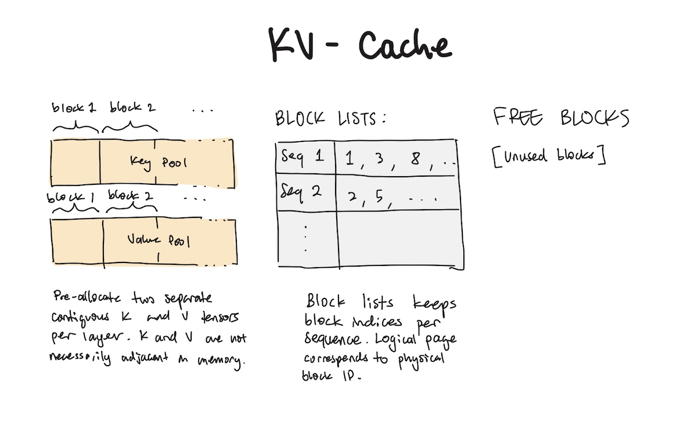
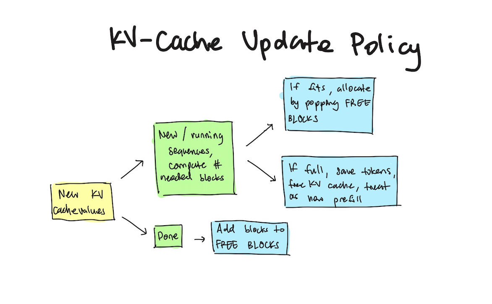
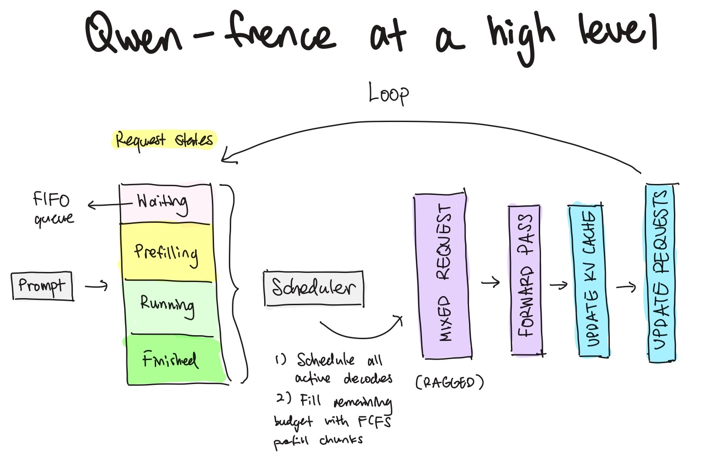
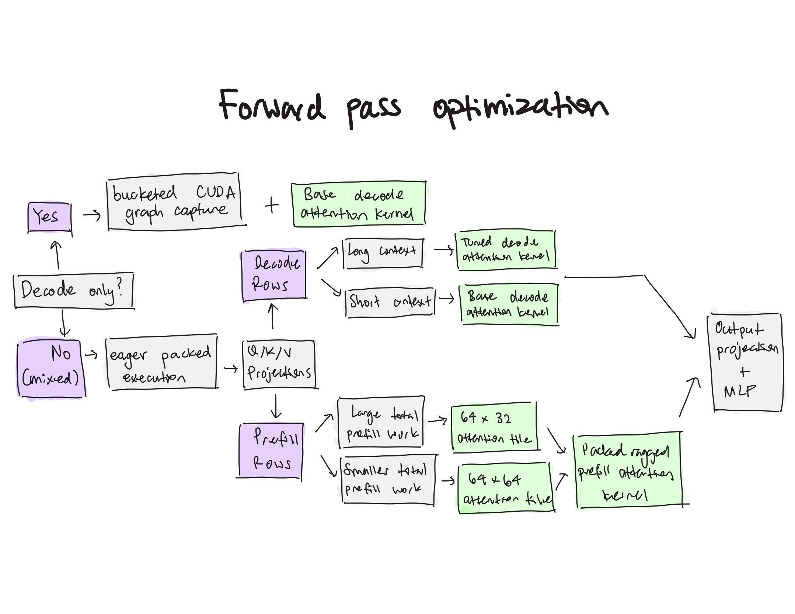

# Qwen-frence

This project wraps a continuous-batching inference engine around Qwen2.5-1.5B. After establishing a scoped baseline, we then improve it through controlled H100 experiments and aggressive profiling. It includes a paged KV cache, custom Triton kernels, packed ragged prefill, resumable chunked prefill, mixed decode/prefill execution, global token-budget scheduling, correctness tests, and matched end-to-end benchmarks.

## KV Cache

We implement a paged KV cache with `BLOCK_SIZE=16`. As a quick overview, paged KV cache breaks up the key and value pools into fixed blocks, and a block list keeps track of the physical block indices mapping to the corresponding logical block indices of each active sequence.

A diagram demonstrating the KV cache design is shown below:

<p align="center">
  
  
</p>

## Engine architecture

We first build a minimal baseline engine with the following key components:

- FCFS continuous batching scheduler
- Mixed batching + packed resumable chunked ragged prefill and packed decode
- Custom kernels (flash infer, fused ops) & kernel dispatch policy
- CUDA graph capture for unmixed batches

A quick diagram detailing the high level design of our inference engine is shown below:



## Forward pass optimization

Our forward pass rests on a number of decision criteria. Unmixed batches use CUDA graph capture to eliminate kernel launch overhead, where as mixed batches follow a profile informed kernel dispatch policy.

Specifically, we see that for long context decode requests that kernel organization by KV head rather than query head can lead to improvements. Interestingly, config sweeps reveal that query head groups of size one (making it mathematically identical to grouping by query heads) empirically lead to reduced latency across long context decode. We also find warp group optimizations that improve concurrency at specific batch thresholds.

For prefill, requests with a large amount of total work (we compute the total work by accounting for the number of additional resumed prefill tokens) yield performance improvements at a tile config of $64\times32$, where as requests with less work operate better at a tile config of $64\times64$.

Yet another diagram is provided below:



## Performance

Matched H100 engine milestones:

| Stage | Output tok/s | vs. previous |
|---|---:|---:|
| PyTorch reference | 97 | 1.00x |
| Paged KV reference | 63 | 0.65x |
| Continuous batching | 389 | 6.14x |
| Bucketed CUDA graphs | 666 | 1.71x |
| Custom kernels | 805 | 1.21x |
| vLLM reference | 1,919 | 2.39x |

Focused improvements:

| Change | Speedup |
|---|---:|
| Packed ragged prefill vs. serial prefill | 1.46x |
| Variable-length attention vs. per-request SDPA | 1.11x |
| Mixed forward pass vs. separate decode/prefill passes | 1.09x median |
| Regime dispatch vs. static custom engine | Up to 1.18x |

See [`RESULTS.md`](RESULTS.md) for workloads, ablations, and limitations.

## Main findings

tldr; packed ragged prefill yields significant end-to-end improvements, profiling reveals resumed prefill is the largest bottleneck, we also see that at long context regimes we can improve performance with attention kernel tuning and kernel dispatch criteria, final profile suggests our engine remains severely decode launch bound (something that piecewise graph capture could solve, since our mixed forward pass does not use any CUDA graph capture).

More detailed description of findings:

- Packed ragged prefill reached a 1.46x end-to-end speedup over serial admission at
  batch 8 / maximum prompt length 4096; replacing per-request SDPA with variable-length
  Triton attention contributed a further 1.11x attention speedup.
- Resuming a 2048-token prefill after a 4096-token cached prefix increased a
  representative mixed iteration from 45.7 ms to 57.3 ms.
- In that mixed trace, MLP work accounted for roughly 46% of CUDA time, decode
  attention 24%, paged prefill attention 13%, and QKV/RoPE/KV movement another 11%.
- The comprehensive work-budget sweep found that the uncapped scheduler maximized
  SLO-compliant output goodput at every tested 40–150 ms threshold. Intermediate caps
  traded rare large stalls for more frequent medium stalls.
- The final 2x2x2 H100 scorecard found that regime dispatch improved the static custom
  engine by as much as 18.0% in long-context workloads, while short-context changes
  ranged from a small regression to a 5.4% gain.
- vLLM remained 2.06x–5.26x faster than the final engine. The gap was smallest in the
  most prefill-heavy regime and largest during low-concurrency, long-output decoding,
  identifying whole-executor decode overhead—not scheduler policy—as the dominant
  remaining bottleneck.

All committed numerical comparisons, cache placement checks, request-isolation checks,
and scheduler lifecycle checks pass. FP16 comparisons use explicit tolerances where
different GEMM launch shapes legitimately change accumulation order.

## Repository map

- [`engine/`](engine/README.md): paged cache, model runners, scheduler, and legacy graph path
- [`custom_kernels/`](custom_kernels/README.md): Triton attention, RoPE, and RMSNorm kernels
- [`correctness/`](correctness/README.md): GPU numerical and lifecycle gates
- [`benchmarks/`](benchmarks/README.md): stable cross-backend and phase scorecards
- [`experiments/`](experiments/README.md): focused ablations, profilers, tests, and results
- [`RESULTS.md`](RESULTS.md): curated end-to-end result narrative and canonical evidence
- [`experiments/RESULTS.md`](experiments/RESULTS.md): measured conclusions and decisions
- [`experiments/INTERVENTIONS.md`](experiments/INTERVENTIONS.md): hypothesis rationale and ship criteria

## Method

Each optimization starts with a measured bottleneck and a falsifiable hypothesis. The
baseline and variant use the same loaded model, deterministic token workload, cache
capacity, and scheduling policy. Results retain raw samples and environment metadata;
correctness runs before performance; failed ideas stay documented.

The accepted attention dispatch, thresholded SwiGLU fusion, and fused RoPE/KV
placement rules are exposed as a separate `regime-dispatched` backend. The unchanged
`custom-kernels` backend remains the end-to-end control, preventing isolated
microbenchmark wins from being mistaken for engine-level improvements. The final
scorecard is retained under `benchmarks/results/regime-scorecard/`.

## Validation

The complete environment and reproduction procedure is documented in
[`REPRODUCING.md`](REPRODUCING.md). Common workflows are exposed as Make targets:

```bash
make unit
make correctness
make scorecard-local
```

GPU experiments require CUDA and were designed around an NVIDIA H100. Before spending
GPU time, run `python3 benchmarks/run_setup_checks.py --suite local` (or `--suite
vllm` in the pinned reference environment).

## Limitations

- Results were measured on one H100 with Qwen2.5-1.5B in FP16; thresholds may not transfer to other models, GPUs, or data types
- Workloads are synthetic. The final eight-regime scorecard used one warmup and one measured run, so its results are observations rather than confidence intervals.
- Decode dispatch estimates work as `batch_size × max_context_length`; this may overestimate highly uneven batches
- The final scorecard enables several optimizations together, so the decode-dispatch improvement has not been isolated end to end
- Mixed prefill/decode execution runs eagerly; CUDA graphs currently cover only supported decode-only batches
- Preemption discards KV state and recomputes from token IDs, which can waste work and cause engine clogging (if KV state continuously needs to preempt the same request)
- vLLM remained 2.06–5.26× faster, primarily indicating unresolved launch, graph-coverage, fusion, and scheduling overhead

## Future work

Sometime later I might return to this stack and try to transfer it into a pure C++ stack (which will also hopefully help me build more low level intuition). I plan to focus my efforts on more research eng/infra work in the next few months aligned with ML systems, RL-infra, & more.
