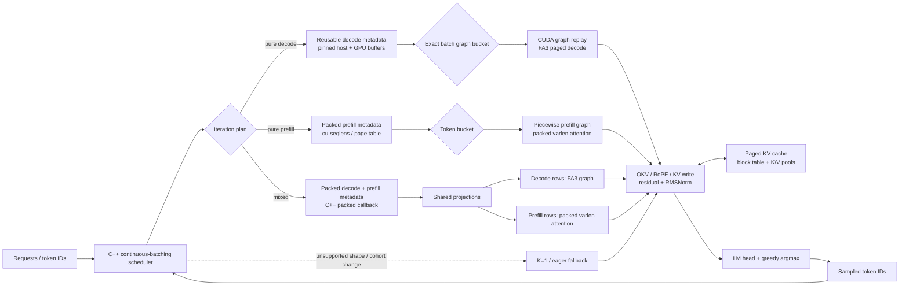

# Qwen-frence

Given Qwen2.5-1.5B and some bounded input regime, how fast can we push inference on one H100? This project wraps a specialized inference engine around Qwen2.5-1.5B and benchmarks it against the general-purpose engine vLLM. We build a grid of inputs spanning short/long contexts and small/large batches, then measure pure prefill, pure decode, and mixed iterations on this fixed model and bounded input scenario. In the end, we are able to beat vLLM performance across these fixed input regimes, and noticably improve decode performance.

## Workload matrix

We vary the following properties of the inputs:

- Batch sizes: 8 and 64
- Prompt lengths: 256 and 2048 tokens
- Output lengths: 128 and 256 tokens
- Burst and staggered mixed arrivals
- Pure prefill/decode phase diagnostics on every cell

## Key improvements

The original engine wrapped a minimal continuous-batching engine with limited fused kernels, CUDA graph capture, a FlashAttention2 kernel, and a Python scheduler. The current engine adds model- and regime-specific kernels, a C++ scheduler, FA3 decode attention, packed projections, and shape-specific graph capture. We intentionally do not use contiguous KV allocation or speculative decoding in this comparison.

Optimization inventory (brief):

- **Scheduling:** C++ continuous batching, packed mixed callbacks, fixed token budgets, reusable pinned/device metadata, double buffering, GPU-resident state prototype, incremental page-table prototype.
- **Graphs:** exact-batch decode graphs, piecewise token-bucket prefill graphs, mixed packed graph buckets, and a K=2/4/8 unrolled-graph prototype (not enabled in the final scorecard).
- **Attention:** packed variable-length prefill attention, FA3 paged decode, packed/varlen mixed attention, fresh and resumed tile dispatch, native CUDA attention prototype, split-K baseline.
- **GEMMs and projections:** packed QKV, packed gate/up, cuBLAS/packed QKV epilogue prototype, output-projection profiling.
- **Layer fusions:** residual-add/RMSNorm, QKV → RoPE/KV-write, K-only RoPE/KV-write, thresholded SwiGLU, fused LM head and exact greedy argmax.
- **Evaluation controls:** matched vLLM runner, full-logit/KV/token gates, scheduler-plan validation, graph mutation checks, fixed eight-cell scorecard.

## High-level system design



The scheduler owns request state, admission, prefill chunks, decode cohorts, and
the paged block table. The model adapter receives one planned iteration and chooses
the specialized path: an exact-batch decode graph, a piecewise packed-prefill graph,
or the packed mixed callback. Every path reads and writes the same paged KV pools;
sampling returns token IDs to the scheduler, which advances or completes requests.
The K-step unrolled graph prototype is intentionally not shown as the production
path; it sits behind the future chunked-decode/fallback design documented below.

## Empirical evidence

The canonical final artifact is [`experiments/results/current-eight-vs-vllm-v2/summary.json`](experiments/results/current-eight-vs-vllm-v2/summary.json). It contains all eight fixed shapes, each measured as burst and staggered mixed workloads. Every one of the 16 end-to-end comparisons favors the current engine:

| Regime | Burst local/vLLM | Mixed local/vLLM |
|---|---:|---:|
| B8 / P256 / O128 | 1.437x | 1.279x |
| B8 / P256 / O256 | 1.386x | 1.322x |
| B8 / P2048 / O128 | 1.202x | 1.173x |
| B8 / P2048 / O256 | 1.226x | 1.192x |
| B64 / P256 / O128 | 1.411x | 1.421x |
| B64 / P256 / O256 | 1.445x | 1.436x |
| B64 / P2048 / O128 | 1.168x | 1.153x |
| B64 / P2048 / O256 | 1.194x | 1.248x |

The synchronized phase artifacts are under [`experiments/results/current-eight-vs-vllm-v2/phases/`](experiments/results/current-eight-vs-vllm-v2/phases/). Decode step latency favors the local engine in every cell (1.21–1.52x). Long-prompt prefill remains slightly slower per step (about 0.93–0.97x), while mixed steps are close (about 1.03–1.09x). Phase medians must be read with step counts because the schedulers can perform different work per step.

### Kept interventions, ranked by measured impact

The ranking below compares the strongest measured effect for each retained intervention;
it labels whether the number is a kernel, phase, ablation, or end-to-end result. These
numbers should not be multiplied together: many rows are nested in the final engine.

| Rank | Kept intervention | Type | Explicit evidence | Scope |
|---:|---|---|---|---|
| 1 | FA3 paged decode attention | Attention kernel | 3.892x decode-wall, 1.511x mixed-wall, and 2.244x complete-workload improvement over split-K at B64/C4096. | Paired full-workload ablation |
| 2 | Exact-batch decode graphs | CUDA graph capture | 2.835x whole-workload and 2.895x decode-phase improvement over eager at B8/P256/O128; standalone B8/C2048 replay was 1.981x eager without input copies. | Integrated ablation + microbench |
| 3 | Packed ragged/variable-length prefill | Packing + attention kernel | 1.46x over serial admission and 1.11x attention improvement in the original B8 packed-prefill sweep. | End-to-end + attention microbench |
| 4 | Prefill token budget | Scheduling policy | B64 control output throughput rose from 2056 tok/s at budget 2048 to 2411 tok/s at 8192 (1.173x). | Full prefill/mixed sweep |
| 5 | Packed mixed callback and exact packed buckets | Scheduler + graph capture | Representative B8 mixed target fell from 12.864 ms separate to 8.412 ms packed-exact-qkv (1.529x); all-history correctness passed. | Matched mixed phase |
| 6 | Packed QKV projection | GEMM/projection packing | 2.34x B8 and 2.35x B64 projection microbench speedups; packed weights are used in the final model path. | Projection microbench |
| 7 | Packed gate/up projection | GEMM/projection packing | 1.19x B8 and 1.14x B64 projection microbench speedups. | Projection microbench |
| 8 | Native QKV postprocess | Fusion: QKV → RoPE/KV write | Full FA3 B64/C4096 decode 1.062x; complete wall 1.026x; logit tolerance passed. | Full-model fusion ladder |
| 9 | Conditional SwiGLU | Fusion: activation + multiply | B64 budget-8192 throughput rose 2341→2416 tok/s; large-row kernel sweep reached about 1.65x. | Full prefill sweep + microbench |
| 10 | C++ scheduler / metadata reuse | Scheduler + metadata | Prior engine 759.5→integrated eager C++ 823.5 output tok/s; packed mixed warm wall 30.812→29.044 ms (1.061x), with logits/KV/scheduler checks passing. | Full workload + model callback gate |
| 11 | Resumed-prefill tile dispatch | Kernel dispatch policy | Paged attention oracle 6.61% over static; the simple two-way rule captured 6.51%. | Paged-attention sweep |
| 12 | Residual add + RMSNorm | Fusion: residual + normalization | Despite a slower isolated kernel, full FA3 B64/C4096 decode improved 1.019x and wall 1.008x. | Full-model fusion ladder |
| 13 | Piecewise packed-prefill graphs | CUDA graph capture | Mutation-safe graph replay; integrated coverage passed correctness and avoided eager prefill calls in the fixed buckets. | Graph safety + integration gate |

### Promising but not integrated

These interventions were implemented or profiled, but are not enabled by the final
eight-cell engine. They mirror the shipped table: motivation, explicit evidence,
and the precise reason they remain outside the production scorecard.

| Intervention | Why it was attempted | Micro/full-model evidence | Why it is not integrated |
|---|---|---|---|
| K=2/4/8 unrolled decode graphs | Amortize host synchronization and D2H token transfer over several decode steps. | Full logits/KV/EOS checks passed; graph composition was roughly 0.2–0.6%, production-like chunk comparisons 0.5–1.1%, and fused-head combinations 1.4–1.8%. | Requires C++ chunk admission, chunk commit, first-EOS truncation, and K=1 fallback for changing cohorts. |
| Fused LM head / exact greedy argmax | Avoid materializing `[B,V]` logits before selecting the token. | Exact token/logit validation passed; about 0.4–0.8% per chunk. | Needs production C++ chunk integration; current final table retains materialized logits for validation. |
| K-only RoPE/KV write | Fuse only cache-writing while preserving the production Q path. | Decode 1.052x and wall 1.021x, correct within tolerance, but weaker than full native postprocess. | Superseded by the stronger integrated QKV postprocess. |
| GPU-resident decode state | Advance sampled IDs, positions, lengths, slots, and page tables without CPU rebuilds. | CPU correctness and automatic fallback pass; no final H100 production timing is recorded. | Opt-in prototype only; mixed arrivals and cohort changes need a matched timing gate. |
| Incremental page-table maintenance | Seed reserved pages once and reuse a stable device table. | Device-table reuse path exists and skips redundant copies when addresses remain stable. | Stable-address assumptions and fallback behavior need full-table H100 evidence. |
| Native CUDA grouped attention | Replace the old Triton attention implementation and test a lower-level long-context path. | B64/C4096: native 0.377 ms vs current 0.661 ms (1.753x); 98,304/98,304 elements allclose. | It is a separate attention implementation, not the matched FA3 production path; no eight-cell integration result. |
| cuBLAS/packed QKV epilogue | Preserve tensor-core GEMM quality while fusing the QKV consumer. | Isolated packed epilogue about 2.04x; full FA3 gate passed and tied native postprocess. | Keep one implementation for maintainability; it was not stacked with native postprocess in the final table. |
| Full mixed forward CUDA graph | Capture decode and packed prefill together. | Exact varlen graph path is implemented and its correctness gate passed for supported buckets. | Dynamic arrivals and changing packed token counts make whole-forward capture too brittle for the general final table. |
| Prefill QKV → RoPE/KV-write fusion | Remove packed prefill QKV intermediates and cache-write traffic. | Implemented as a candidate and covered by fusion harnesses, but no final eight-cell promotion result. | Hold until its padded-token mask and KV-state behavior are validated across all buckets. |

### Failed or rejected ideas

These were actually implemented or measured, but the evidence did not justify
shipping them in the final engine.

| Intervention | Why it was attempted | Evidence | Rejection reason |
|---|---|---|---|
| Grouped-GQA head sharing | Reuse KV reads across query-head groups. | Grouped variants were slower; the 1.753x native result came from single-head/layout changes, not grouping. | The grouping hypothesis was not supported. |
| Custom full-QKV fused GEMM | Fuse projection, RoPE, and KV writes into one custom kernel. | Isolated result looked 1.8x faster, but full decode fell to 0.892x and wall to 0.948x; accumulated logits exceeded tolerance. | Reject this Triton implementation. |
| Mixed attention overlap | Hide decode bandwidth work under prefill compute on separate streams. | Stream upper-bound experiments did not produce a stable end-to-end gain. | Resource contention and join dependencies outweighed theoretical overlap. |

The detailed status, source paths, tolerances, and missing production gates are in [`experiments/FUSION_CHECKLIST.md`](experiments/FUSION_CHECKLIST.md). Historical rationale and rejected hypotheses remain in [`experiments/RESULTS.md`](experiments/RESULTS.md) and [`experiments/INTERVENTIONS.md`](experiments/INTERVENTIONS.md).

Important scope note: the final eight-cell scorecard uses K=1 decode graph replay.
The K=2/4/8 unrolled graph is a validated prototype only. Its benchmark retains
logits and checks EOS, but production integration still needs C++ chunk admission,
one commit per generated chunk, first-EOS truncation, and automatic K=1 fallback
when arrivals or request lengths change. None of the final vLLM speedup claims are
attributed to K-step capture.

## What the profiles imply

The matched FA3 profile shows why the final engine wins: the high-return path is
decode execution—FA3 attention, exact-batch graphs, packed projections, native
QKV postprocessing, and the C++ scheduler. Long-context attention still scales
more steeply with context than vLLM, so attention remains the strongest next
optimization target. The old aggregate profiler category table should not be
used for component claims because overlapping CUDA activities can double-count;
use the matched phase and per-kernel artifacts instead.

## Results

- End-to-end comparison with vLLM: [`current-eight-vs-vllm-v2/summary.json`](experiments/results/current-eight-vs-vllm-v2/summary.json)
- Prefill budget and fusion sweeps: [`prefill-budget-b64-3x3/report.json`](experiments/results/prefill-budget-b64-3x3/report.json)
- FA3 versus split-K: [`fa3-vs-splitk-b64-l4096-o256/report.json`](experiments/results/fa3-vs-splitk-b64-l4096-o256/report.json)
- FA3 fusion ladder: [`fa3-fusions-b64-c4096-v2/report.json`](experiments/results/fa3-fusions-b64-c4096-v2/report.json)
- K-step/fused-head validation: [`fa3-kstep-head-b64-c4096-v1/report.json`](experiments/results/fa3-kstep-head-b64-c4096-v1/report.json)
- Comprehensive decode profile: [`comprehensive-decode-profile-20260920/summary.json`](experiments/results/comprehensive-decode-profile-20260920/summary.json)

## Correctness

- Full-logit same-history checks for graph and fusion candidates
- Sampled-token and KV-cache checks for QKV/RoPE/KV-write changes
- CUDA graph mutation/replay safety checks
- Scheduler plan, graph-bucket, request-length, and KV-capacity validation
- Exact output-token comparison against the matched vLLM workload

The final table has a small number of greedy-token divergences in some cells. Those
are recorded in each `comparison.json`; they do not get silently converted into
performance claims.

## Reproducing the benchmarks

On the H100 pod, use the pinned vLLM environment and cached model snapshot:

```bash
cd /workspace/qwen-frence
git pull --ff-only
bash experiments/integration/run_current_eight_checkpoint.sh plan
bash experiments/integration/run_current_eight_checkpoint.sh check
bash experiments/integration/run_current_eight_checkpoint.sh run-table
bash experiments/integration/run_current_eight_checkpoint.sh analyze
```

The wrapper reuses only validated prior cells and refuses stale workload, model,
capacity, or commit metadata. Phase results are written under
`experiments/results/current-eight-vs-vllm-v2/phases/`.

## Repository layout

- `engine/`: scheduler, graph capture, model runner, and KV cache
- `custom_kernels/`: Triton and CUDA kernels
- `experiments/`: benchmarks, profiles, ablations, tests, and result ledgers
- `benchmarks/`: backend comparison harnesses

## Limitations

- Results are for Qwen2.5-1.5B, FP16, one H100, greedy decoding, and the fixed eight-cell regime.
- Workloads are synthetic and do not establish universal superiority over vLLM.
- A few cells have token-level divergences despite passing numerical tolerances; investigate before treating this as a production correctness claim.
- K-step graphs and some metadata-residency ideas are implemented experimentally but are not yet fully integrated into the final production scheduler.
- Contiguous KV allocation and speculative decoding were intentionally excluded from the comparison.
