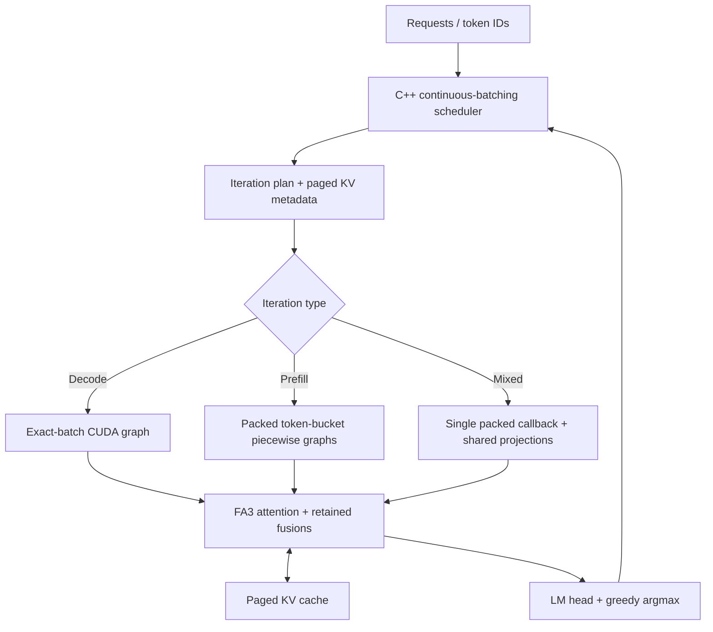

# Qwen-frence

How fast can we push inference on Qwen2.5-1.5B run on a singular H100 node? We present a model-specific inference engine wrapped around Qwen2.5-1.5B. Across eight fixed workloads, the engine achieves competitive performance to vLLM on end-to-end tokens/second (in both burst throughput and mixed). Our result is highlighted by **1.22–1.39× faster decode steps** against **vLLM 0.30.0**.

## Results

The final results are in [summary.json](experiments/results/final-accepted-8192/summary.json).

- NVIDIA H100 80GB HBM3; Qwen2.5-1.5B; FP16; greedy decoding.
- Batch sizes 8/64, prompt lengths 256/2048, output lengths 128/256.
- One warmup and **three measured runs per cell and engine**; medians reported.
- Our prefill token budget: **8192**. vLLM uses its default: **3072**.
- We report our **speedup**, namely **1.5×** means 1.5 times faster
- FA3 attention uses the external vLLM FlashAttention wrapper where as scheduling, graph integration, and the retained custom fusions are implemented in this repository

### Complete-workload throughput

Burst submits all requests together. Mixed submits requests in two staggered waves. Both timings include prefill and decode. Throughput is generated output tokens per second.

| Batch / prompt / output | Our burst tok/s | vLLM burst tok/s | Burst speedup | Our mixed tok/s | vLLM mixed tok/s | Mixed speedup |
|---|---:|---:|---:|---:|---:|---:|
| 8 / 256 / 128 | 3,415 | 3,097 | 1.103× | 3,281 | 3,253 | 1.009× |
| 8 / 256 / 256 | 3,436 | 3,264 | 1.052× | 3,355 | 3,346 | 1.003× |
| 8 / 2048 / 128 | 2,529 | 2,521 | 1.003× | 2,435 | 2,485 | 0.980× |
| 8 / 2048 / 256 | 2,817 | 2,852 | 0.988× | 2,775 | 2,851 | 0.973× |
| 64 / 256 / 128 | 20,140 | 18,621 | 1.082× | 19,410 | 18,697 | 1.038× |
| 64 / 256 / 256 | 22,132 | 21,026 | 1.053× | 21,642 | 21,287 | 1.017× |
| 64 / 2048 / 128 | 6,883 | 6,986 | 0.985× | 6,483 | 6,612 | 0.981× |
| 64 / 2048 / 256 | 9,645 | 9,923 | 0.972× | 9,395 | 9,474 | 0.992× |

Geometric-mean speedup: **1.029× burst**, **0.999× mixed**.

### Pure decode step latency

[Phase reports](experiments/results/final-accepted-8192/phases/) measure synchronized pure-decode iterations. Each step generates one token per active request. Step latency is the median within each run, then the median across three runs.

**Local means our engine. Latencies are local / vLLM, in milliseconds. Decode speedup = vLLM ms ÷ local ms.**

| Batch / prompt / output | Decode step ms, local / vLLM | Decode speedup |
|---|---:|---:|
| 8 / 256 / 128 | 2.283 / 2.874 | 1.258× |
| 8 / 256 / 256 | 2.292 / 2.909 | 1.269× |
| 8 / 2048 / 128 | 2.520 / 3.076 | 1.221× |
| 8 / 2048 / 256 | 2.505 / 3.076 | 1.228× |
| 64 / 256 / 128 | 2.551 / 3.492 | 1.369× |
| 64 / 256 / 256 | 2.590 / 3.592 | 1.387× |
| 64 / 2048 / 128 | 3.718 / 4.686 | 1.260× |
| 64 / 2048 / 256 | 3.747 / 4.719 | 1.260× |

Both engines record 127 pure-decode steps for 128-token outputs and 255 for 256-token outputs. Prefill and mixed step timings remain in the raw reports; they are omitted here because the scheduled token counts differ between engines.

### Correctness

Both engines produce the same output-token counts: **110,592 tokens each** across the 16 burst/mixed comparisons.

| Workload | Entire output sequences identical to vLLM |
|---|---:|
| Burst | 285 / 288 requests — 98.96% |
| Mixed | 286 / 288 requests — 99.31% |
| Combined | 571 / 576 requests — 99.13% |

These counts compare complete generated sequences (compare tokens at positions). Candidate tests also check same-history logits, KV-cache writes, scheduler plans, and graph replay safety.

## Engine design


```mermaid
flowchart TD
    A[Requests / token IDs] --> B[C++ continuous-batching scheduler]
    B --> C[Iteration plan + paged KV metadata]
    C --> D{Iteration type}
    D -->|Decode| E[Exact-batch CUDA graph]
    D -->|Prefill| F[Packed token-bucket piecewise graphs]
    D -->|Mixed| G[Single packed callback + shared projections]
    E --> H[FA3 attention + retained fusions]
    F --> H
    G --> H
    H <--> I[Paged KV cache]
    H --> J[LM head + greedy argmax]
    J --> B
```

The scheduler handles admission, prefill chunks, decode cohorts, and page allocation. The adapter selects decode, prefill, or packed mixed execution. All paths share the paged KV cache.

## Retained optimizations

The final configuration retains C++ scheduling, packed mixed callbacks, exact-batch decode graphs, piecewise packed-prefill graphs, packed QKV/gate-up projections, decode QKV/RoPE/KV-write postprocessing, decode residual-add/RMSNorm, and conditional prefill SwiGLU.

The following ablations and microbenchmarks explain those choices. They are historical intervention results, not additional speedups over the final vLLM 0.30.0 comparison.

| Rank | Kept intervention | Type | Evidence | Experiment |
|---:|---|---|---|---|
| 1 | FA3 paged decode attention | Attention kernel | 3.892x decode-wall, 1.511x mixed-wall, and 2.244x complete-workload improvement over split-K at B64/C4096. | Paired full-workload ablation |
| 2 | Exact-batch decode graphs | CUDA graph capture | 2.835x whole-workload and 2.895x decode-phase improvement over eager at B8/P256/O128; standalone B8/C2048 replay was 1.981x eager without input copies. | Integrated ablation + microbench |
| 3 | Packed ragged/variable-length prefill | Packing + attention kernel | 1.46x over serial admission and 1.11x attention improvement in the original B8 packed-prefill sweep. | End-to-end + attention microbench |
| 4 | Prefill token budget | Scheduling policy | B64 control output throughput rose from 2056 tok/s at budget 2048 to 2411 tok/s at 8192 (1.173x). | Full prefill/mixed sweep |
| 5 | Packed mixed callback and exact packed buckets | Scheduler + graph capture | Representative B8 mixed target fell from 12.864 ms separate to 8.412 ms packed-exact-qkv (1.529x); all-history correctness passed. | Matched mixed phase |
| 6 | Packed QKV projection | GEMM/projection packing | 2.34x B8 and 2.35x B64 projection microbench speedups; packed weights are used in the final model path. | Projection microbench |
| 7 | Packed gate/up projection | GEMM/projection packing | 1.19x B8 and 1.14x B64 projection microbench speedups. | Projection microbench |
| 8 | QKV RoPE/KV-write postprocess (Triton) | Fusion: QKV → RoPE/KV write | Full FA3 B64/C4096 decode 1.062x; complete wall 1.026x; logit tolerance passed. | Full-model fusion ladder |
| 9 | Conditional SwiGLU | Fusion: activation + multiply | B64 budget-8192 throughput rose 2341→2416 tok/s; large-row kernel sweep reached about 1.65x. | Full prefill sweep + microbench |
| 10 | C++ scheduler / metadata reuse | Scheduler + metadata | Prior engine 759.5→integrated eager C++ 823.5 output tok/s; packed mixed warm wall 30.812→29.044 ms (1.061x), with logits/KV/scheduler checks passing. | Full workload + model callback gate |
| 11 | Resumed-prefill tile dispatch | Kernel dispatch policy | Paged attention oracle 6.61% over static; the simple two-way rule captured 6.51%. | Paged-attention sweep |
| 12 | Residual add + RMSNorm | Fusion: residual + normalization | Despite a slower isolated kernel, full FA3 B64/C4096 decode improved 1.019x and wall 1.008x. | Full-model fusion ladder |
| 13 | Piecewise packed-prefill graphs | CUDA graph capture | Mutation-safe graph replay; integrated coverage passed correctness and avoided eager prefill calls in the fixed buckets. | Graph safety + integration gate |

### Other ideas

| Candidate | Direct evidence | Decision |
|---|---|---|
| Native CUDA grouped-decode attention | At B64/C4096, the [matched warm test](experiments/results/decode-memory-causality/memory-causality-20260921T011458Z.json) measured native CUDA at 0.425 ms/layer, old Triton at 0.717 ms/layer, and FA3 at 0.122 ms/layer. Native beat old Triton but was **3.49x slower than FA3**. | Do not replace FA3. This kernel accepts one query token per request and cannot run multi-token prefill as written. |
| K-only RoPE/KV write | Correct within tolerance; decode 1.052x and wall 1.021x, versus 1.062x and 1.026x for the integrated full QKV postprocess. | Superseded by the faster integrated fusion. |
| cuBLAS/packed QKV epilogue | About 2.04x in isolation; passed the full FA3 gate but tied the integrated Triton QKV postprocess. | Equivalent alternative, not an additive fusion. |
| Full mixed forward CUDA graph | Correctness passed for supported fixed buckets. | Dynamic arrivals and packed token counts prevent general coverage. |
| Grouped-GQA head sharing | Grouped variants were slower in the matched attention sweep. | No measured gain over the selected FA3 path. |
| Custom full-QKV fused GEMM | Isolated kernel was about 1.8x faster, but full decode fell to 0.892x, wall to 0.948x, and logits exceeded tolerance. | Rejected for full-model slowdown and numerical error. |
| Mixed attention overlap | Two-stream upper-bound tests did not show a stable end-to-end gain. | Resource contention and join dependencies erased the benefit. |


## Experimental options

CUTLASS GEMM epilogues, shared graph pools, boundary-buffer reuse, GPU-resident evolving metadata, fused greedy output, and K-step capture are not enabled in the final scorecard. No final fused-head A/B result is included. I decided to cut scope after experimenting with some GEMM epilogues since it would have required rewriting GEMM kernels and tuning them for this specific model and hardware configuration.

## Reproducing the comparison

Use the vLLM 0.30.0 environment, the pinned model snapshot, and an H100. Run the reference once:

```bash
/root/vllm-env/bin/python -u experiments/integration/benchmark_final_8.py \
  --backend vllm \
  --output-dir experiments/results/final-vllm030-reference \
  --prefill-budget 8192 \
  --model Qwen/Qwen2.5-1.5B \
  --warmups 1 --repetitions 3
```

Run our engine against the saved reference:

```bash
/root/vllm-env/bin/python -u experiments/integration/benchmark_final_8.py \
  --backend local \
  --reference-dir experiments/results/final-vllm030-reference \
  --output-dir experiments/results/final-accepted-8192 \
  --prefill-budget 8192 \
  --model Qwen/Qwen2.5-1.5B \
  --warmups 1 --repetitions 3
```

The local command does not launch vLLM. References are validated before reuse. The pinned model must already be cached; alternatively, pass its complete local snapshot directory with `--model`.

## Repository layout

- `engine/`: C++ scheduler, graph capture, model runner, and paged KV cache.
- `custom_kernels/`: Triton and CUDA kernels.
- `experiments/`: benchmarks, profiles, ablations, tests, and saved reports.
- `benchmarks/`: backend comparison harnesses.

## Scope

Qwen2.5-1.5B, FP16, one H100, greedy decoding, and eight synthetic workloads. No speculative decoding or contiguous KV allocation.

## License

[MIT](LICENSE).
